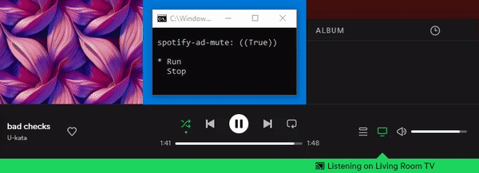

# spotify-ad-mute
This is a program to mute spotify whenever an ad appears.

* Download the latest release of [spotify-ad-mute.exe](https://github.com/marcoagbarreto/spotify-ad-mute/releases/download/v0.1.2/spotify-ad-mute.exe)

## Example

1. Run ```spotify-ad-mute.exe``` or ```spotify-ad-mute.py```
2. Select ```Run``` using the arrow keys and press ```Enter ```
3. Profit.
4. Select ```Stop``` to stop the program.



## Code Usage

clone the repository (no installation required, source files are sufficient):
        
    https://github.com/marcoagbarreto/spotify-ad-mute.git

dependencies:

    import os
    import time
    import pyautogui
    from threading import Thread
    from pick import pick

or [download and extract the zip](https://github.com/marcoagbarreto/spotify-ad-mute/archive/main.zip) into your project folder.

## Known limitations:
* Spotify must be on the main screen and always visible.
